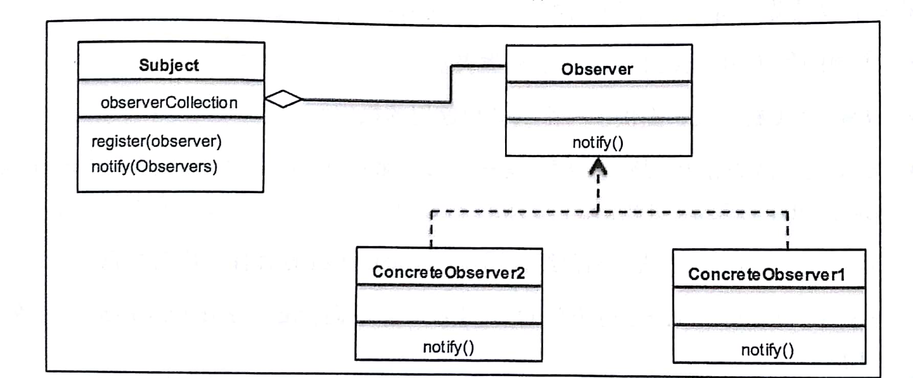

# 六、观察者模式－了解对象的情况

这章可以讨论行为型设计模式：观察者设计模式  

## 本章主题

- 行为型设计模式简介  
- 观察者设计模式及其 UML图  
- 利用 Python3.x代码实现一个真实用例  
- 松耦合的强大威力  
- 常见问答  


## 1. 行为型模式简介

- 创建型模式的工作原理是基于对象的创建机制的。由于这些模式隔离了对象的创建细节，所以使得代码能够与要创建的对象的类型相互独立。结构型模式用于设计对象和类的结构，从而使它可以相互协作以获得更大的结构。它们重点关注的是简化结构以及识别类和对象之间的关系  

- 结构型模式用于设计对象和类的结构，从而使它们可以相互协作以获得更大的结构。重点在于简化结构以及识别类和对象之间的关系  

- 行为型模式重点关注的是对象的责任。它们用来处理对象之间的交互，以实现更大的功能。行为型模式：对象之间应该能够彼此交互，同时还应该是松散耦合的  
  
  
# 2. 理解观察者设计模式

在观察者设计模式中，对象(主题)维护了一个依赖(观察者)列表，以便主题可以使用观察者定义的任何方法通知所有观察者它所发生的变化  

观察者模式的主要目标：  
- 它定义了对象之间的一对多的依赖关系，从而使得一个对象中的任何更改都将自动通知给其他依赖对象  
- 它封装了主题的核心组件  

观察者模式的应用场景：  
- 在分布式系统中实现事物服务  
- 用作新闻机构的架构  
- 股票市场也是观察者模式的一个大型场景  

Python3.x实现简单的观察者模式  
```py
class Subject:
	def __init__(self):
		self.__observers = []
	
	def register(self, observer):
		self.__observers.append(observer)

	def notifyAll(self, *args, **kwargs):
		for observer in self.__observers:
			observer.notify(self, *args, **kwargs)


class Observer1:
	def __init__(self, subject):
		subject.register(self)
	
	def notify(self, subject, *args):
		print(type(self).__name__, ":: Got", args, "From", subject)


class Observer2:
	def __init__(self, subject):
		subject.register(self)
	
	def notify(self, subject, *args):
		print(type(self).__name__, ":: Got", args, "From", subject)


subject = Subject()
observer1 = Observer1(subject)
observer2 = Observer2(subject)
subject.notifyAll("notification")

```
运行结果：  
Observer1 :: Got ('notification',) From <__main__.Subject object at 0x7f9f99fc6518>  
Observer2 :: Got ('notification',) From <__main__.Subject object at 0x7f9f99fc6518>  

---

## 3. 观察者模式的 UML类图  



观察者有三个主要角色：主题，观察者和具体观察者  

- 主题：类Subject 需要了解Observer。Subject类具有许多方法，诸如 register()和 deregister()等，Observer可以通过这些方法注册到 Subject类中。因此，一个 Subject可以处理多个 Observer  

- 观察者：它为关注主题的对象定义了一个接口。它定义了 Observer需要实现的各个方法，以便在主题发生变化时能够获得相应的通知  

- 具体观察者(ConcreteObserver)：它用来保存应该与 Subject的状态保持一致的状态。它实现了 Observer接口以保持其状态与主题中的变化相一致  


## 4. 现实世界中的观察者模式

我们以新闻机构为例展示观察者模式的现实世界场景  

```py
# coding:utf-8
from abc import ABCMeta, abstractmethod

# 主题：订阅新闻的接口
class NewPublisher:
	def __init__(self):
		self.__subscribers = []
		self.__latestNews = None

	# 提供注册
	def attch(self, subscriber):
		self.__subscribers.append(subscriber)

	# 提供注销
	def detach(self):
		return self.__subscribers.pop()

	# 返回已经订户列表
	def subscribers(self):
		return [type(x).__name__ for x in self.__subscribers]

	# 返回注册的所有用户
	def notifySubscribers(self):
		for sub in self.__subscribers:
			sub.update()
```


