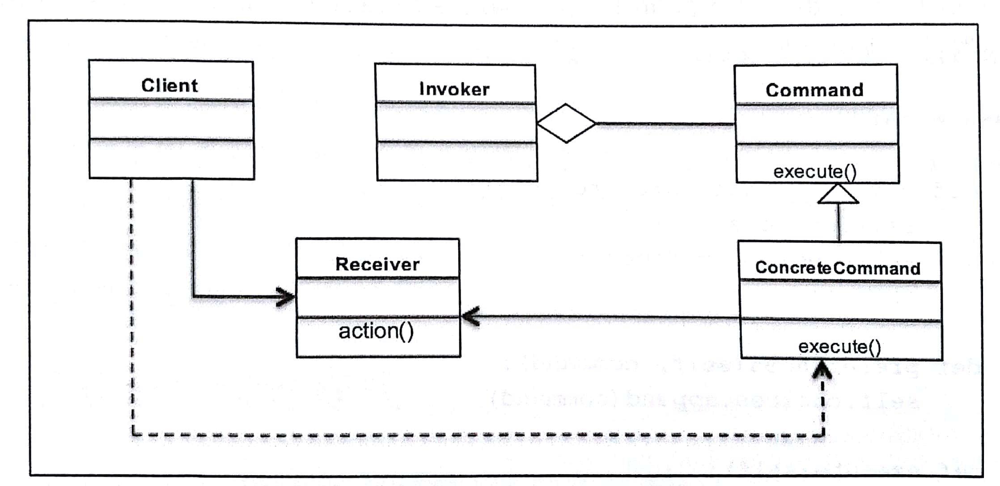

# 七、命令模式－封装调用
这章讨论行为型设计模式：命令模式         

##  本章主题

- 命令设计模式简介                      
- 命令模式及其 UML图                    
- Python3.x 代码实现的真实用例          
- 命令模式的优缺点                      
- 常见问答                              

## 1. 命令设计模式简介

行为模式侧重于对象的响应性，它利用对象之间的交互实现更强大的功能                                          
命令模式是一种行为设计模式，其中对象用于封装完成一项操作时或在触发一个事件时所需的全部信息。这些信息包括：  
+ 方法名称；        
+ 拥有方法的对象；  
+ 方法参数的值      

## 2. 了解命令设计模式

命令模式通常使用以下术语：COmmand, Receiver, Invoker, Client  

命令模式的主要意图：            
- 将请求封装为对象              
- 可用不同的请求对客户进行参数化   
- 允许将请求保存在队列中     
- 提供面向对象的回调         

命令模式应用场景：                       
- 根据需要执行的操作对对象进行参数化      
- 将操作添加到队列并在不同地点执行请求    
- 创建一个结构来根据较小操作完成高级操作  

以下 Python代码实现了命令模式：          
```py

class Wizard():

    def __init__(self, src, rootdir):
        self.choices = []
        self.rootdir = rootdir
        self.src = src

    def preferences(self, command):
        self.choices.append(command)

    def execute(self):
        for choice in self.choices:
            if list(choice.values())[0]:
                print("Copying binaries --", self.src,
                      " to ", self.rootdir)
            else:
                print("No Operation")


if __name__ == "__main__":
    wizard = Wizard('python3.6.gzip', '/usr/bin/')

    wizard.preferences({'python': True})
    wizard.preferences({'java': False})

    wizard.execute()

```
运行结果：                                          
Copying binaries -- python3.6.gzip  to  /usr/bin/  
No Operation                                       

## 3. 命令模式的 UML类图  



可以发现，命令模式主要涉及５个参与者：  
* Command:  声明执行操作的接口         
* ConcreteCommand:  讲一个 Receiver对象和一个操作进行绑定  
* Client:  创建 ConcreteCommand对象并设定其接收对象       
* Invoker:  要求该 ConcreteCommand执行这个请求            
* Receiver:  要知道如何实施与执行一个请求相关的操作        

这个流程是这样的：                                            
客户端请求执行命名，调用者接受命令，封装它并将其放置到队列中    
ConcreteCommand类根据所请求的命命令来指导接收者执行特定的动作  

下面通过代码理解命令模式的所有参与者的情况：                   

```py
from abc import ABCMeta, abstractmethod

class Command(metaclass=ABCMeta):

    def __init__(self, receiver):
        self.receiver = receiver

    @abstractmethod
    def execute(self):
        pass


class ConcreteCommand(Command):
    def __init__(self, receiver):
        super().__init__(receiver)
        self.receiver = receiver

    def execute(self):
        self.receiver.action()


class Receiver:
    def action(self):
        print("Receiver Action")


class Invoker:
    def command(self, cmd):
        self.cmd = cmd

    def execute(self):
        self.cmd.execute()


if __name__ == "__main__":
    receiver = Receiver()
    cmd = ConcreteCommand(receiver)

    invoker = Invoker()
    invoker.command(cmd)
    invoker.execute()

```
运行结果：        
Receiver Action  

## 4. 实现现实世界中的命令模式

```py

from abc import ABCMeta, abstractmethod

# 订单基类(Command)
class Order:
    @abstractmethod
    def execute(self):
        pass

# 购买股票的订单(ConcreteCommand)
class BuyStockOrder(Order):
    def __init__(self, stock):
        self.stock = stock

    # 执行买的操作
    def execute(self):
        self.stock.buy()

# 卖股票的借口(ConcreteCommand)
class SellStockOrder(Order):
    def __init__(self, stock):
        self.stock = stock

    def execute(self):
        self.stock.sell()

# 股票交易
class StockTrade:
    def buy(self):
        print("You will buy stocks")

    def sell(self):
        print("You will sell stocks")

# 代理(invoker)
class Agent:
    def __init__(self):
        self.__orderQueue = []

    def placeOrder(self, order):
        self.__orderQueue.append(order)
        order.execute()


if __name__ == "__main__":
    # client
    stock = StockTrade()
    buyStock = BuyStockOrder(stock)
    sellStock = SellStockOrder(stock)

    # invoker
    agent = Agent()
    agent.placeOrder(buyStock)
    agent.placeOrder(sellStock)

```
运行结果：            
You will buy stocks   
You will sell stocks  

在软件中应用命令模式的方式有很多种，这里讨论与云应用密切相关的两个实现:           
- 重做或回滚操作：     
-- 在实现回滚或重做操作时，开发人员可以做两件不同的事情                            
-- 这些是在文件系统或内存中创建快照，当被要求回滚时，恢复到该快照                   
-- 使用命令模式时，可以存储命令序列，并且要求进行重做时，重新运行相同的一组操作即可  

- 异步任务执行：      
-- 在分布式系统中，我们通常要求设备具备异步执行任务的功能，以便核心服务在大量请求涌来时不会发生阻塞                                  
-- 在命令模式中，Invoker 对象可以维护一个请求队列，并将这些任务发送到 Receiver对象，以便它们可以独立于主应用程序线程来完成相应的操作  


## 5. 命令模式的优缺点

命令模式优点：  
+ 将调用操作的类与知道如何执行该操作的对象解耦  
+ 提供队列系统后，可以创建一系列命令           
+ 添加新命令更加容易，并且无需更改现有代码     
+ 还可以使用命令模式来定义回滚系统，如：在向导实例中，我们可以编写一个回滚方法  

命令模式的缺点：  
+ 为了实现目标，需要大量的类和对象进行协作。应用程序开发人员为了正确开发这些类，需要倍加小心  
+ 每个单独的命令都是一个 ConcreteCommand类，从而增加了需要实现和维护的类的数量              


## 6. 常见问答

- 命令模式中是否可以不实现Receiver和ConcreteCommand?   
是的，可以。许多软件应用程序也就是通过这种方式来使用命令模式的。这里唯一要注意的是调用者和接收者之间的交互了。如果接收器未被定义的话，则去耦程度机会下降；此外，参数化的优势也就不复存在了  

- 我使用什么数据结构来实现Invoker对象中的队列机制？  
在本章中的股票交易示例，我们使用一个列表来实现队列。但是，命令模式还可以使用一个堆栈来实现队列机制，这在开发具有重做或回滚功能的时候常有帮助  


## 7. 小结  

1. 命令模式的概念和在软件架构中有效使用                              
2. 如何使用命令模式来封装在稍后某个时间点触发事件或动作所需的所有信息  
3. 使用UML类图和Python3.x代码示例来进一步理解命令模式                 
4. 问答部分提供与命令模式相关的设计思想，还介绍了该模式的优缺点        
