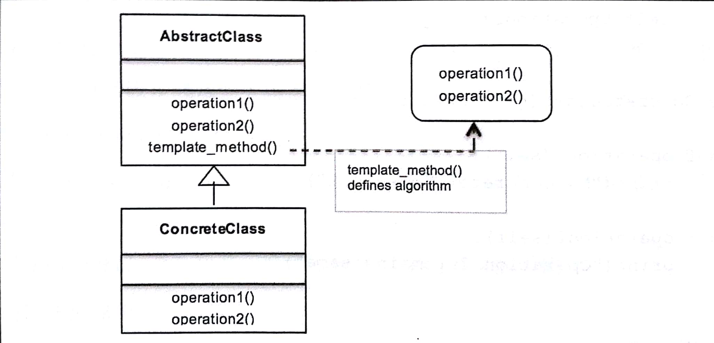

# 八、模板方法模式－封装算法

这章讨论行为型设计模式：模板方法模式  

## 本章主题
- 模板方法设计模式简介  
- UML类图剖析模板设计模式  
- Python3.6 代码实现真实用例  
- 模板方法模式的优缺点  
- 好莱坞原则、模板方法和模板钩子  
- 常见问答  


## 1. 定义模板方法模式

模板方法模式是一种行为型设计模式，它通过一种称为模板方法的方式来定义程序框架或算法  
在讨论模板方法模式时，可以使用抽象类来定义算法的步骤  

模板方法模式应用场景：  
- 当多个算法或类实现类似或相同逻辑的时候；  
- 在子类中实现算法有助于减少重复代码的时候；  
- 可以让子类利用覆盖实现行为来定义多个算法的时候  

模板方法主要意图：  
- 使用基本操作定义算法的框架  
- 重新定义了子类的某些操作，而无需修改算法的结构  
- 实现代码重用并避免重复工作  
- 利用通用接口或实现  

Python3.6代码实现编译器的示例：假设想为IOS设备开发自己的交叉编译器并运行程序  
```py
from abc import ABCMeta, abstractmethod

# 抽象类：Compiler
class Compiler(metaclass=ABCMeta):
    @abstractmethod
    def collectSource(self):
        pass

    @abstractmethod
    def compileToObject(self):
        pass

    @abstractmethod
    def run(self):
        pass

    # 模板方法
    def compileAndRun(self):
        self.collectSource()
        self.compileToObject()
        self.run()

# 具体类: iOS设备编译器
class IOSCompiler(Compiler):
    def collectSource(self):
        print("Collecting Swift Source Code")

    def compileToObject(self):
        print("Compiling Swift code to LLVM bit_code")

    def run(self):
        print("Program running on runtime environment")


iOS = IOSCompiler()
iOS.compileAndRun()
```
运行结果：  
Collecting Swift Source Code  
Compiling Swift code to LLVM bit_code  
Program running on runtime environment  

## 2. 模板方法模式的 UML类图

  

AbstractClass: 在抽象方法的帮助下定义算法的操作或步骤，这些步骤将被具体子类覆盖  
template_method(): 定义算法的框架  
ConcreteClass: 实现步骤，来执行算法子类的特定步骤  

```py
from abc import ABCMeta, abstractmethod

# 抽象类
class AbstractClass(metaclass=ABCMeta):
    def __init__(self):
        pass

    @abstractmethod
    def operation_first(self):
        pass

    @abstractmethod
    def operation_second(self):
        pass

    # 模板方法
    def template_method(self):
        print("Defining the Algorithm.first --> second..")
        self.operation_first()
        self.operation_second()

# 具体类
class ConcreteClass(AbstractClass):
    def operation_first(self):
        print("My Concrete 1st operation")

    def operation_second(self):
        print("2nd operation remains same")

# 客户端
class Client:
    def main(self):
        self.concrete = ConcreteClass()
        self.concrete.template_method()

```
运行结果：  
Defining the Algorithm.first --> second..  
My Concrete 1st operation  
2nd operation remains same  


## 3. 现实生活中的模板方法模式  
以一个旅行社Dev Travels 的示例说明模板方法设计模式：  

抽象对象由Trip（接口）来代表。  
```py
from abc import abstractmethod, ABCMeta


class Trip(metaclass=ABCMeta):

	@abstractmethod
	def setTransport(self):
		pass
		
	@abstractmethod
	def day1(self):
		pass
		
	@abstractmethod
	def day2(self):
		pass
		
	@abstractmethod
	def day3(self):
		pass
	
	@abstractmethod
	def returnHome(self):
		pass
	
	def itinerary(self):
		self.setTransport()
		self.day1()
		self.day2()
		self.day3()
		self.returnHome()
		
```

下面开发两个具体类：VeniceTrip 和 MaldivesTrip  
```py
class VeniceTrip(Trip):
	def setTransport(self):
		print('Take a boat and find your way in the Grand Canal')
		
	def day1(self):
		print("Visit St Mark's Basilica in St Mark's Square")
		
	def day2(self):
		print("Appreciate Doge's Palace")
		
	def day3(self):
		print('Enjoy the food near the Rialto Bridge')
		
	def returnHome(self):
		print('Get souvenirs for friends and get back')
		
	
class MaldivesTrip(Trip):
	def setTransport(self):
		print('On foot, on any island, Wow!')
		
	def day1(self):
		print('Enjoy the marine life of Banana Reef')
		
	def day2(self):
		print('Go for the water sports and snorkelling')
		
	def day3(self):
		print('Relax on the beach and enjoy the sun')
	
	def returnHome(self):
		print('Dont feel like leaving the beach..')

```

以下是Dev 旅行社以及他们如何根据客户的选择安排旅行的具体实现：  
```py
class TravelAgency:
	def arrange_trip(self):
		choice = input("What kind of place you'd like to go to historical or to a beach?")
		
		if choice == 'historical':
			self.trip = VeniceTrip()
			self.trip.itinerary()
		if choice == 'beach':
			self.trip = MaldivesTrip()
			self.trip.itinerary()
			
			
TravelAgency().arrange_trip()

```

## 4. 模板方法模式————钩子  
钩子是抽象类中声明的方法，它通常被赋予一个默认实现。钩子背后的思想是为子类提供按需钩取算法的能力。   
但是，它并不强制子类使用钩子，它可以很容易地忽略这一点。  

## 5. 好莱坞原则与模板方法
模板方法模式，它是高级抽象类，它安排定义算法的步骤，根据算法的工作模式，通过调用低层类来定义各个步骤的具体实现。  


## 6. 优缺点与常见问答
优点：  
1. 没有代码重复;  
2. 使用继承，能够对代码进行重用;   
3. 灵活性，允许子类决定如何实现算法中的步骤。  

缺点：
1. 调试和理解流程困难，文档和严格的错误处理必须由程序员完成；  
2. 维护是一个问题，因为低层还是高层的变更都可能对实现造成干扰.  

常见问答  
Q1. 是否应该禁止低层组件调用高层组件中的方法？  
A:  不，低层组件当然通过继承来调用高层组件。然而，注意的是，不能出现循环依赖性，即高层组件和低层组件彼此依赖。  

Q2. 策略模式是否类似于模板模式？  
A： 策略模式和模板模式都是封装算法。   
模板取决于继承，而策略使用组合。模板方法模式是通过子类化在编译时进行算法选择，而策略模式时在运行时进行选择。  

## 7. 小结
这章我们研究了如何使用模板方法设计模式来封装算法，并通过覆盖子类中的方法提供实现不同行为的灵活性。  
