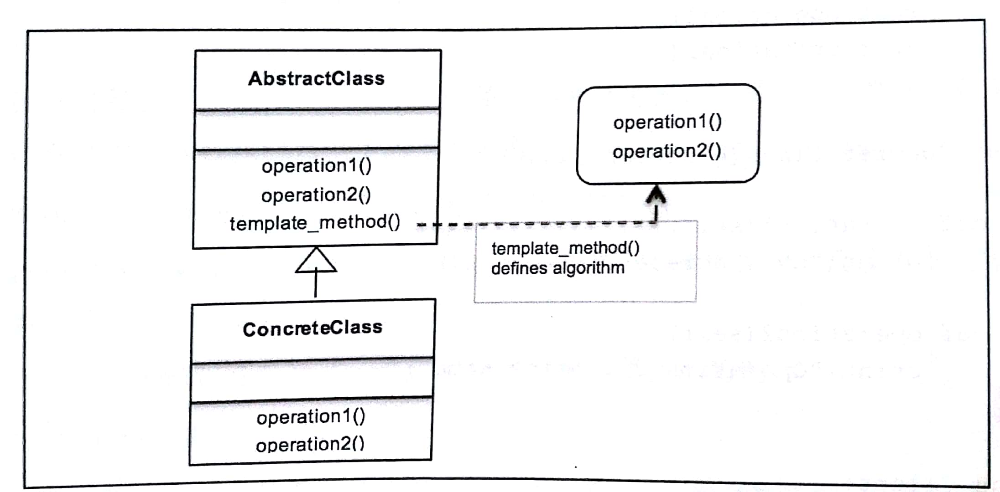

# 八、模板方法模式－封装算法

这章讨论行为型设计模式：模板方法模式  

## 本章主题
- 模板方法设计模式简介  
- UML类图剖析模板设计模式  
- Python3.6 代码实现真实用例  
- 模板方法模式的优缺点  
- 好莱坞原则、模板方法和模板钩子  
- 常见问答  


## 1. 定义模板方法模式

模板方法模式是一种行为型设计模式，它通过一种称为模板方法的方式来定义程序框架或算法  
在讨论模板方法模式时，可以使用抽象类来定义算法的步骤  

模板方法模式应用场景：  
- 当多个算法或类实现类似或相同逻辑的时候；  
- 在子类中实现算法有助于减少重复代码的时候；  
- 可以让子类利用覆盖实现行为来定义多个算法的时候  

模板方法主要意图：  
- 使用基本操作定义算法的框架  
- 重新定义了子类的某些操作，而无需修改算法的结构  
- 实现代码重用并避免重复工作  
- 利用通用接口或实现  

Python3.6代码实现编译器的示例：假设想为IOS设备开发自己的交叉编译器并运行程序  
```py
from abc import ABCMeta, abstractmethod

# 抽象类：Compiler
class Compiler(metaclass=ABCMeta):
    @abstractmethod
    def collectSource(self):
        pass

    @abstractmethod
    def compileToObject(self):
        pass

    @abstractmethod
    def run(self):
        pass

    # 模板方法
    def compileAndRun(self):
        self.collectSource()
        self.compileToObject()
        self.run()

# 具体类: iOS设备编译器
class IOSCompiler(Compiler):
    def collectSource(self):
        print("Collecting Swift Source Code")

    def compileToObject(self):
        print("Compiling Swift code to LLVM bit_code")

    def run(self):
        print("Program running on runtime environment")


iOS = IOSCompiler()
iOS.compileAndRun()
```
运行结果：  
Collecting Swift Source Code  
Compiling Swift code to LLVM bit_code  
Program running on runtime environment  

## 2. 模板方法模式的 UML类图

  

AbstractClass: 在抽象方法的帮助下定义算法的操作或步骤，这些步骤将被具体子类覆盖  
template_method(): 定义算法的框架  
ConcreteClass: 实现步骤，来执行算法子类的特定步骤  

```py
from abc import ABCMeta, abstractmethod

# 抽象类
class AbstractClass(metaclass=ABCMeta):
    def __init__(self):
        pass

    @abstractmethod
    def operation_first(self):
        pass

    @abstractmethod
    def operation_second(self):
        pass

    # 模板方法
    def template_method(self):
        print("Defining the Algorithm.first --> second..")
        self.operation_first()
        self.operation_second()

# 具体类
class ConcreteClass(AbstractClass):
    def operation_first(self):
        print("My Concrete 1st operation")

    def operation_second(self):
        print("2nd operation remains same")

# 客户端
class Client:
    def main(self):
        self.concrete = ConcreteClass()
        self.concrete.template_method()

```
运行结果：  
Defining the Algorithm.first --> second..  
My Concrete 1st operation  
2nd operation remains same  

---

## 3. 现实生活中的模板方法模式

